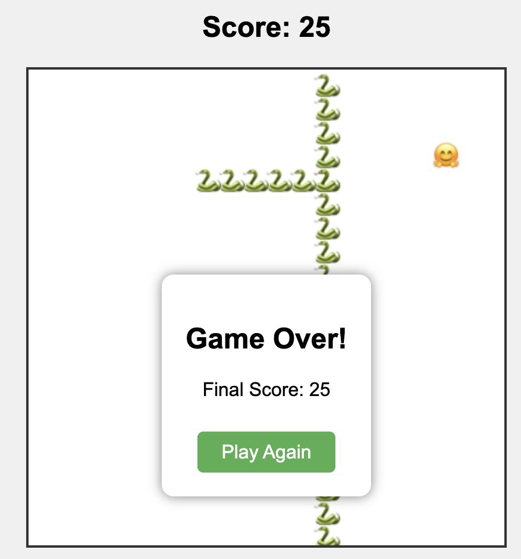

# Snake Game - A PM-Engineer Collaboration with ClaudeAI

This project demonstrates an interesting collaboration between a Product Manager (me) and an AI Engineer (GPT) to create a classic Snake game. The project showcases how clear product requirements can be effectively transformed into a functional web game through iterative development.

## Project Overview

- **Role Distribution:**
  - Product Manager (Chung-Hao): Provided clear requirements, feedback, and feature requests
  - Engineer (claude): Implemented the technical solutions and game logic

## Play the Game

🎮 [Play Snake Game Here](https://lch99310.github.io/snake-game-completely-created-by-gpt-4o/)

## Game Instructions

### How to Play
1. Press any arrow key to start the game
2. Use arrow keys to control the snake:
   - ⬆️ Up Arrow: Move up
   - ⬇️ Down Arrow: Move down
   - ➡️ Right Arrow: Move right
   - ⬅️ Left Arrow: Move left

### Game Rules
1. **Objective:** Eat as many targets (🤗) as possible to grow your snake (🐍) and increase your score
2. **Scoring:**
   - Each target eaten = 1 point
   - Score is displayed at the top of the game

### Special Features
1. **Wall Passing:** Snake can pass through walls and appear on the opposite side
2. **Growth Mechanism:** Snake grows longer each time it eats a target
3. **Game Over Conditions:**
   - If the snake hits itself
   - Score is displayed when game ends
   - Click "Play Again" to restart

## Development Process

This game was developed through clear requirement phases:
1. Initial game setup with basic movement
2. Score implementation and display
3. Snake growth mechanics
4. Wall passing feature
5. Collision detection and game over state
6. Visual improvements with emojis

## Technical Stack
- Pure HTML5
- No external dependencies
- Hosted on GitHub Pages

## Future Improvements?
Feel free to suggest new features or improvements by creating an issue!
